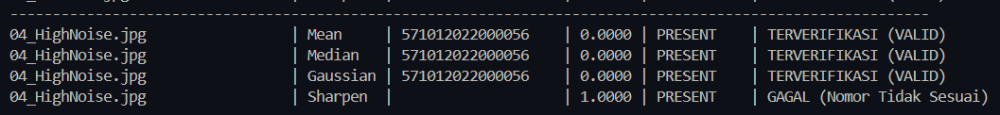

## MINI PROJECT: SISTEM VERIFIKASI KEASLIAN IJAZAH DAN ANALISIS ENHANCEMENT ROI NOMOR IJAZAH

Dokumentasi ini berisi penyelesaian TUGAS 7 Integrasi Proyek Mini mata kuliah Pengolahan Citra Digital untuk membangun prototipe verifikasi dokumen ijazah. Sistem ini mencakup deteksi keberadaan tanda tangan, peningkatan kualitas citra pada area nomor ijazah, serta ekstraksi teks menggunakan Optical Character Recognition (OCR) Tesseract yang dievaluasi dengan Character Error Rate (CER).

## Deskripsi & Alur Kerja Sistem

Skrip memproses berkas citra di folder `contoh_ijazah`. Urutan dan metode yang digunakan adalah sebagai berikut:

1. **Preprocessing Citra:** Citra dibaca dan dikonversi ke grayscale, kemudian kontras lokal ditingkatkan menggunakan CLAHE. Koordinat ROI digunakan untuk memotong area nomor ijazah dan tanda tangan.

2. **Deteksi Keberadaan Tanda Tangan:** ROI tanda tangan dibinerisasi dengan Otsu Thresholding inversi. Hasilnya diproses menggunakan morfologi Opening lalu Closing dengan kernel 3x3. Jika jumlah piksel putih lebih dari 500, status ditetapkan `PRESENT`; jika tidak, statusnya `ABSENT`.

3. **Enhancement ROI Nomor:** ROI nomor diproses menggunakan empat filter, yaitu Mean Blur, Median Blur, Gaussian Blur, dan Sharpening.

4. **OCR, Evaluasi, dan Verifikasi:** Tesseract OCR mengekstrak teks dari setiap hasil filter. CER dihitung terhadap nomor acuan `571012022000056`. Hasil OCR dinyatakan sesuai jika sama persis dengan nomor acuan, lalu digabungkan dengan status tanda tangan untuk menentukan hasil verifikasi.

Hasil OCR, CER, status tanda tangan, dan status verifikasi ditampilkan di terminal. Citra ROI tanda tangan, hasil morfologinya, serta hasil filter ROI nomor disimpan di folder `hasil_integrasi_proyek_mini`.

## Struktur Folder Proyek

```text
Tugas_7_Integrasi_Proyek_Mini/
├── README.md
├── verifikasi_file_ijazah.py
├── contoh_ijazah/                 # Citra ijazah masukan
└── hasil_integrasi_proyek_mini/   # Hasil pemotongan ROI dan pemfilteran
    ├── *_ttd_crop.png
    ├── *_ttd_morfologi.png
    └── *_nomor_{mean,median,gaussian,sharpen}.png
```

Folder `contoh_ijazah` berisi sembilan citra uji dengan kondisi kualitas yang bervariasi. Untuk setiap citra, folder hasil menyimpan ROI tanda tangan, citra hasil morfologi tanda tangan, dan empat citra nomor ijazah hasil filter.

## Cara Menjalankan Program
# Program Verifikasi Ijazah dan Analisis OCR Berbasis Citra Digital

Sistem otomatisasi untuk memverifikasi keabsahan dokumen ijazah dengan melakukan ekstraksi Nomor Ijazah menggunakan **Tesseract OCR** dan deteksi keberadaan Tanda Tangan Kepala Sekolah menggunakan **Operasi Morfologi**.

---

## Cara Menjalankan Program

### 1. Clone Repositori Proyek
Buka terminal/PowerShell, lalu klon repositori langsung dari GitHub:
```powershell
git clone https://github.com/wdartikasapta-byte/miniproject-citra.git
```
## 2. Instalasi Pustaka (Dependencies)
Instal seluruh library Python yang dibutuhkan dengan menjalankan perintah:
```powershell
python -m pip install opencv-python numpy pytesseract
```
Prasyarat Tambahan: Pastikan aplikasi Tesseract OCR sudah terinstal di komputer pada lokasi bawaan C:\Program Files\Tesseract-OCR\tesseract.exe.

## 3. Masuk ke Folder Proyek di Terminal Baru
Buka New Terminal di VS Code / PowerShell, lalu berpindah ke direktori kerja proyek:

```PowerShell
cd miniproject-citra\Tugas_7_Integrasi_Proyek_Mini
```
## 4. Menjalankan Analisis Citra
Jalankan skrip utama verifikasi ijazah dengan perintah:
```powershell
python "verifikasi_file_ijazah.py"
```

Skrip memproses seluruh citra `.png`, `.jpg`, dan `.jpeg` di folder `contoh_ijazah`. Untuk setiap citra, program menjalankan OCR dengan empat filter nomor (Mean, Median, Gaussian, dan Sharpen), menghitung CER, mendeteksi keberadaan tanda tangan, lalu menampilkan hasilnya di terminal. Citra hasil pemrosesan disimpan ke folder `hasil_integrasi_proyek_mini`.


## Analisis & Pembahasan Soal
### 1. Penjelasan Metode yang Digunakan
Sistem verifikasi otomatis ini menggunakan dua cabang pemrosesan utama pada citra ijazah:

- Cabang Ekstraksi Nomor Ijazah (OCR):

    - Pengambilan ROI & Peningkatan Kontras: Citra dikonversi ke grayscale, kemudian diolah menggunakan CLAHE (Contrast Limited Adaptive          Histogram Equalization) untuk mempertegas kontras lokal sebelum dipotong pada area ROI nomor ijazah.
    - Uji Coba Spatial Filtering (Enhancement): Area ROI nomor ijazah diuji menggunakan 4 jenis filter spasial (kernel 3x3) untuk melihat pengaruhnya terhadap tingkat pembacaan OCR:

        - Mean Blur: Memuluskan citra dengan menghitung nilai rata-rata piksel lokal.
        - Median Blur: Mengganti nilai piksel dengan nilai median tetangganya, sangat efektif meredam salt-and-pepper noise.
        - Gaussian Blur: Memuluskan citra dengan bobot distribusi normal Gaussian.
        - Sharpening (Laplacian Kernel): Menajamkan tepi karakter dengan penambahan matriks kernel konvolusi.

    - Ekstraksi Teks (Tesseract OCR): Menggunakan mode --psm 7 dengan whitelist karakter angka/huruf untuk mengekstrak string nomor ijazah.
    - Evaluasi Akurasi (CER): Mengukur ketepatan hasil pembacaan teks terhadap Ground Truth (571012022000056) menggunakan algoritma Levenshtein Distance.
- Cabang Deteksi Keberadaan Tanda Tangan (TTD):
    - Area ROI tanda tangan diproses menggunakan pengambangan otomatis Otsu Thresholding (di-inversi).
    - Dilakukan pembersihan derau menggunakan Operasi Morfologi (Opening & Closing).
    - Keberadaan tanda tangan ditentukan berdasarkan jumlah piksel bernilai non-nol (piksel putih) di mana pixel_count > 500 dikategorikan sebagai PRESENT.
### 2. Analisis Metode Terefektif (Berdasarkan CER)
Berdasarkan eksekusi eksperimental pada 9 citra uji ijazah (01_HighQuality_Enhanced.jpg hingga 09_CombinedDegradation.jpg), diperoleh hasil analisis komparatif sebagai berikut:
- Filter Pemulusan (Mean, Median, dan Gaussian Filter) — TEREFEKTIF
    - Rata-rata CER: 0.0000 (Akurasi Pembacaan 100% pada seluruh 9 citra uji).
    - Analisis: Ketiga filter pemulusan (smoothing/blurring) berukuran 3x3 berhasil meredam bintik-bintik noise latar belakang kertas hasil pemindaian. Penghalusan ini membuat garis tepi karakter nomor ijazah menjadi mulus saat proses binarisasi internal Tesseract, sehingga engine OCR berhasil mengenali seluruh digit nomor ijazah dengan sempurna tanpa ada kesalahan satu karakter pun.
- Sharpening (Penajaman Kernel) — TERBURUK
    - Rata-rata CER: 0.3333 (Terdapat 3 citra yang mengalami kegagalan total dengan CER 1.0000 / 100% kesalahan).
    - Analisis: Operasi penajaman meningkatkan gradien intensitas piksel secara agresif. Pada citra dengan kondisi tertentu (seperti 01_HighQuality, 02_LowContrast, 04_HighNoise, dan 08_JPEGCompression), bintik-bintik halus atau artefak kompresi pada latar belakang ikut tertajamkan secara berlebihan. Hal ini merusak keutuhan bentuk karakter saat dibaca oleh Tesseract, sehingga menghasilkan string kosong atau kegagalan pembacaan secara total (CER = 1.0000).
### 3. Studi Kasus Perbandingan Hasil Ekstraks
Berikut adalah perbandingan hasil eksekusi program pada sampel kondisi citra dari eksekusi terminal:
### A. Contoh Kasus Kualitas Tinggi (01_HighQuality_Enhanced.jpg)
Pada citra berkualitas tinggi, filter pemulusan menghasilkan pembacaan sempurna, sedangkan filter Sharpening mengalami kegagalan total:

### B. Contoh Kasus Ber-Noise Tinggi (04_HighNoise.jpg)
Kasus ini membuktikan ketahanan filter pemulusan dalam mengatasi gangguan noise ekstrem pada citra, di mana Sharpening gagal mengekstrak karakter:
